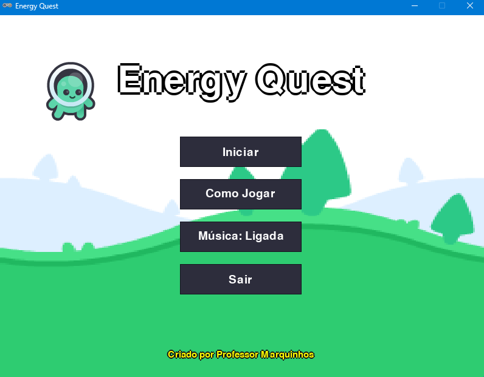
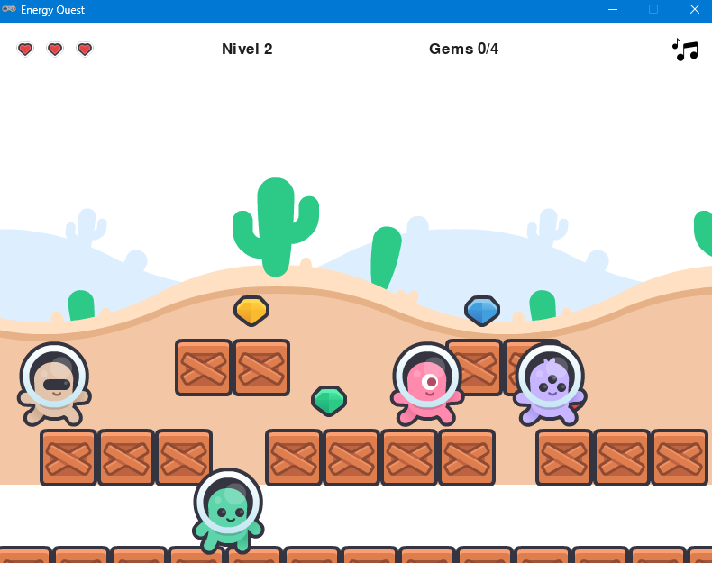

<div align="center">
  
# 🎮 Energy Quest

**Um jogo de plataforma 2D desenvolvido com Python e Pygame Zero**

*Projeto desenvolvido como parte do processo seletivo da Kodland*

[](https://www.python.org/downloads/)
[](https://pygame-zero.readthedocs.io/)
[](LICENSE)

</div>

---

## 📸 Screenshots do Jogo

### Menu Principal


### Gameplay


---

## 📖 Sobre o Projeto

**Energy Quest** é um jogo de plataforma lateral onde você controla o Prof. Bolota em uma jornada para coletar todas as fontes de energia (cristais) espalhadas pelo cenário. Após coletar todos os cristais, uma chave especial aparece, permitindo que você destranque a porta e avance para o próximo nível.

### 🎯 Objetivos

- ✅ Coletar todas as gemas de energia espalhadas pelo nível
- 🔑 Pegar a chave que surge após coletar todas as gemas
- 🚪 Destrancar a porta e completar a fase
- ⚔️ Desviar dos inimigos patrulheiros
- ❤️ Manter suas vidas intactas

### 🌟 Características do Jogo

- **5 níveis progressivos** com dificuldade crescente
- **Sistema de vidas** com 3 corações (6 pontos de vida)
- **Pulo duplo** para acrobacias avançadas
- **Inimigos patrulheiros** com IA de movimento
- **Sistema de física realista** com gravidade e colisões
- **Trilha sonora dinâmica** que muda a cada nível
- **Efeitos sonoros** para todas as ações
- **Mecânica de plataformas atravessáveis** (pressione S/↓)

### 📝 Tecnologias Utilizadas

- **[Python 3.8+](https://www.python.org/)** 
- **[Pygame Zero](https://pygame-zero.readthedocs.io/)**
- **[Pygame (Rect)](https://www.pygame.org/docs/ref/rect.html)**
  
---

## 🎮 Como Jogar

| Ação | Tecla(s) |
|------|----------|
| **Mover para esquerda** | `←` ou `A` |
| **Mover para direita** | `→` ou `D` |
| **Pular** | `W` ou `↑` |
| **Descer de plataforma** | `S` ou `↓` |
| **Interagir com porta** | `ESPAÇO` (quando tiver a chave) |
| **Ligar/Desligar música** | `M` |

### 💡 Dicas

- 🔍 Observe o padrão de movimento dos inimigos antes de avançar
- 📉 Pressione `S` ou `↓` para descer através de plataformas
- 🗝️ A chave só aparece após coletar todas as gemas
- ❤️ Fique atento à barra de vida no canto superior esquerdo
- 🦘 Use o pulo duplo para alcançar plataformas altas
- 🎵 Desative a música pressionando `M` se preferir jogar em silêncio

---

## 📁 Estrutura de Pastas

```
teste_kodland/
│
├── 📄 energy_quest.py          # Arquivo principal do jogo
├── 📄 README.md                # Este arquivo
├── 📄 requirements.txt         # Dependências do projeto
├── 📄 .gitignore               # Arquivos ignorados pelo Git
│
├── 📁 images/                  # Sprites e recursos visuais
│   ├── 📁 backgrounds/         # Fundos e cenários (7 arquivos)
│   ├── 📁 player/              # Sprites do personagem Prof. Bolota (4 arquivos)
│   ├── 📁 enemies/             # Sprites dos inimigos (12 arquivos)
│   ├── 📁 items/               # Gems, chaves, portas (10 arquivos)
│   ├── 📁 hud/                 # Elementos de interface (8 arquivos)
│   ├── 📁 tiles/               # Plataformas e blocos (1 arquivo)
│   └── 📁 screenshots/         # Prints do jogo para documentação (2 arquivos)
│
├── 📁 sounds/                  # Efeitos sonoros (.ogg) - 7 arquivos
│   ├── coletar_cristal.ogg     # Som de coleta de gemas
│   ├── som_pulo.ogg            # Som de pulo
│   ├── menu_click.ogg          # Som de clique nos botões
│   ├── som_alavanca.ogg        # Som de abertura de porta
│   ├── tutorial_open.ogg       # Som de tela de tutorial
│   ├── colisao.ogg             # Som de dano ao colidir com inimigo
│   └── fim_de_jogo.ogg         # Som de game over
│
├── 📁 music/                   # Trilhas sonoras (.mp3) - 7 arquivos
│   ├── intro_theme.mp3         # Música do menu principal
│   ├── grasslands_theme.mp3    # Nível 1 - Planície
│   ├── desert_theme.mp3        # Nível 2 - Deserto
│   ├── mushroom_theme.mp3      # Nível 3 - Cogumelos
│   ├── jungle_theme.mp3        # Nível 4 - Nuvens
│   ├── dungeon_theme.mp3       # Nível 5 - Floresta Final
│   └── congrats.mp3            # Música de vitória
│
```

---

## 🚀 Como Instalar e Jogar

### ⚙️ Pré-requisitos

- **Python 3.8 ou superior** instalado no sistema
- **pip** (gerenciador de pacotes do Python)

### 📦 Instalação

1. **Clone ou baixe o projeto** para sua máquina:

```bash
git clone https://github.com/the-physicist/teste_kodland.git
cd teste_kodland
```

Ou simplesmente extraia o ZIP e navegue até a pasta.

2. **Instale as dependências necessárias**:

**Opção 1 - Usando requirements.txt (recomendado)**:
```bash
pip install -r requirements.txt
```

**Opção 2 - Instalação manual**:
```bash
pip install pgzero pygame
```

### ▶️ Executando o Jogo

#### No Windows:

```bash
python -m pgzrun energy_quest.py
```

#### No Linux/Mac:

```bash
python3 -m pgzrun energy_quest.py
```

---

## 🎨 Assets e Recursos

Todos os assets visuais e sonoros utilizados no projeto estão organizados nas pastas `images/`, `sounds/` e `music/`. 

### Sprites Principais

- **Prof. Bolota** (personagem principal): idle, walk_1, walk_2, jump
- **Inimigos**: Beige, Pink e Purple (cada um com animações de idle, walk_a, walk_b, jump)
- **Itens**: 4 tipos de gems (azul, vermelha, verde, amarela), 4 chaves correspondentes
- **Cenário**: Porta (fechada/aberta), plataformas, fundos

### Sistema de Áudio

- **Música de fundo**: Cada nível possui sua própria trilha sonora temática
- **Efeitos sonoros**: 7 sons diferentes para ações do jogo
- **Controle de áudio**: Música pode ser ligada/desligada pressionando `M` durante o jogo
- **Formatos**: OGG para efeitos sonoros, MP3 para músicas

---

## 📧 Contato

Projeto desenvolvido por **Marcos Oliveira** como parte do processo seletivo da Kodland.

---

<div align="center">

**Desenvolvido com 💙 dedicação e atenção aos detalhes**

*Kodland - Processo Seletivo 2025*

</div>
